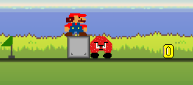
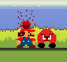
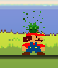
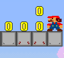
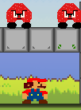
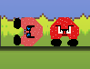

# MarioArcade
Технологии: C#, .NET, Windows Forms

## Описание
2D-аркадная игра в стиле классической серии *Super Mario Bros.*  
Реализовано:
- Управление игроком (WASD)
- Сбор монет (+1 очко)
- Противник с ИИ
- Уничтожение противника прыжком сверху (+2 очка)
- Загрузка уровней из JSON

## Скриншоты

*Игровой процесс: старт*

*Старт, игрок, блок, противник и монета в процессе передвижения игрока по локации.*

  

*Пользовательский интерфейс*

*В верхней части окна слева отображаются элементы управления процессом: кнопки «Restart» и «Pause», а также счёта «Score: 0». В правом — иконки в виде «сердца», обозначающие количество жизней игрока на данный момент.*

  

*Эффект неуязвимости*

*После неудачного столкновения с противником сразу же над игроком появляется красная спора, сигнализирующая о состоянии неуязвимости. В этот момент игрок может свободно проходить сквозь противников без получения урона. Через 1 секунду спора изменяется на зелёную спору длительностью 5 секунд, а эффект неуязвимости заканчивается.*

 
 

*Блоки*

*Представлены 3 типа блоков: серый блок (Block), серый блок с красной меткой (BlockR) и серый блок с зелёной меткой (BlockG), исчезающие при контакте игроком сверху и снизу соответственно.*

 
 

*Противник* 

*Противник представлен в виде «гриб-мухомор», который умеет двигаться по локации, а также наносить урон игроку с последующими эффектами. На изображении показан «живой» и «уничтоженный» противник.*

 

## Структура проекта
- `Objects/` — игровые сущности (`Player`, `Enemy`, `Coin`, `Block`, `Flag` и др.)
- `Managers/` — система управления (`Camera`, `InputManager`, `LevelManager`, `UIManager` и др.)
- `Data/` — конфигурация и спавн (`ObjectType`, `ObjectSpawner`)
- `UI/` — пользовательский интерфейс
- `sprites/` — графические ресурсы (PNG)

## Сборка и запуск
1. Откройте `MarioArcade.sln` в **Visual Studio 2022**
2. Убедитесь, что целевая платформа — **x86** или **Any CPU**
3. Нажмите **F5** или **Debug → Start Debugging**

> Требуется .NET 6+ (обычно установлен вместе с Visual Studio 2022).

## Уровни
Уровни хранятся в папке `Levels/` в формате JSON.  
Пример: `level1.json`

## Лицензия
Проект создан в учебных целях. Свободен для некоммерческого использования.

